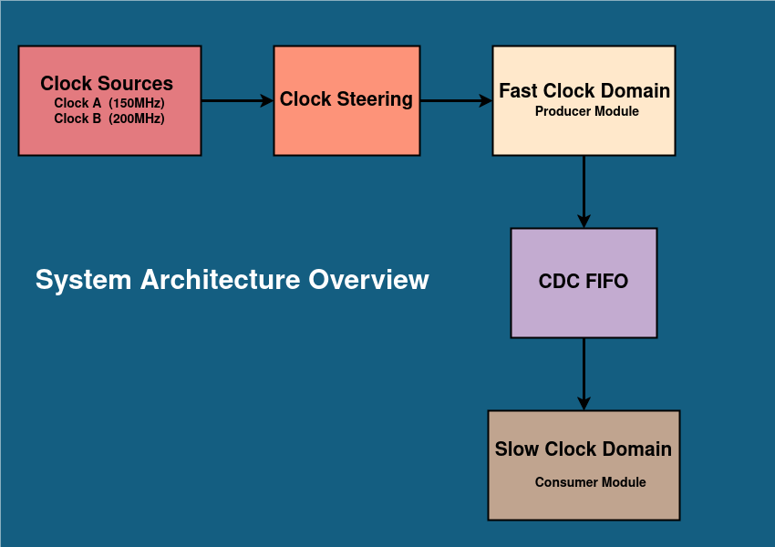

# Fpga Multi Clock Synchronization

This project demonstrates **multi-clock domain data synchronization** using **clock domain crossing (CDC)** techniques, including **clock steering**, **MMCM-based clock generation**, and an **asynchronous FIFO** for safe data transfer between different clock domains.

## Module Breakdown

This design shows how to transfer data from a fast-changing clock domain to a slower one using:

- 🕘 **Multiple Clock Inputs** (150 MHz and 200 MHz)  
- 🧭 **Clock Steering** (select one clock at runtime)  
- 🔁 **Basic Mixed-Mode Clock Manager (MMCM)** to generate internal clocks  
- 📦 **CDC FIFO** (asynchronous FIFO) for safe data transfer across domains  
- 🎯 **Producer-Consumer model** for data movement and monitoring  

## Getting Started

This project is written in SystemVerilog and is intended for use with **Xilinx Vivado**.

1. **Open Vivado** and create a new project.

2. **Add Design Sources**:
   - Add all files from `hdl/src/`:
     - `cdc_fifo.sv`
     - `data_consumer.sv`
     - `data_producer.sv`
     - `mixed_mode_clock_manager.sv`
   - Add `hdl/top.sv` and set it as your **Top Module**.

3. **Add Simulation Sources**:
   - Add `test/tb_top.sv` to the simulation sources.

4. **Run Simulation**:
   - Set `tb_top` as the simulation top module.
   - Run a behavioral simulation to verify functionality.

